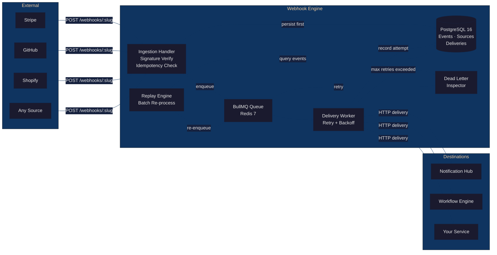

# Webhook Ingestion & Replay Engine

A multi-tenant webhook gateway that receives inbound webhooks from any source, verifies signatures, persists every payload, and delivers them to configured downstream endpoints with guaranteed at-least-once delivery. Failed deliveries enter a dead-letter queue for inspection and replay.

**Live:** [webhooks.kingsleyonoh.com](https://webhooks.kingsleyonoh.com)

---

## The Problem

Every team that integrates with Stripe, GitHub, Shopify, or any webhook-emitting service ends up building the same thing: a receiver that validates signatures, retries on failure, and logs what happened. They build it inside the consuming service, tightly coupled, with ad-hoc retry logic that silently drops events when something goes wrong.

Operations teams get no visibility. When a delivery fails at 2 AM, nobody knows until a customer reports missing data. There's no audit trail, no replay capability, and no way to inspect what was received versus what was delivered.

This engine is the front door for all inbound webhooks. It persists before processing, retries with exponential backoff, dead-letters after exhaustion, and lets you replay any historical event through the delivery pipeline. Adding a new webhook source is a database row, not a code change.

---

## Architecture



---

## Key Decisions

**Fastify over Express** -- Fastify 5.x gives schema-based validation, a plugin system that enforces encapsulation, and raw body buffering out of the box. Express would have needed `body-parser` gymnastics to preserve the original bytes for HMAC verification while still parsing JSON for handlers.

**BullMQ over a custom retry loop** -- Writing your own retry scheduler with `setTimeout` or cron sounds simple until you need persistence across restarts, concurrency control, and backpressure. BullMQ gives all of that on top of Redis, with delayed jobs for exponential backoff and built-in dead-lettering. I rejected Kafka and NATS as overkill for this throughput target (500 events/min).

**Persist-before-process over fire-and-forget** -- Every webhook payload hits PostgreSQL before a single delivery job is enqueued. If Redis goes down, you lose delivery speed but never lose data. The database is the source of truth; delivery is a side effect. This means the ingestion endpoint can return 200 in under 50ms while delivery happens asynchronously.

**Source-agnostic design over provider-specific parsers** -- The engine does not know what Stripe or GitHub is. Signature algorithm, header name, and signing secret are stored per-source in the database. Adding a new provider is `INSERT INTO sources`, not a pull request. This keeps the codebase from accumulating provider-specific branches that rot when APIs change.

**Drizzle ORM over raw SQL** -- Drizzle gives type-safe queries with zero runtime overhead (it compiles to SQL strings, not an ORM object graph). I rejected Prisma because it requires a separate query engine binary and its migration system is heavier than what this project needs. Drizzle-kit migrations are plain SQL files.

---

## Setup

### Prerequisites

- Node.js 22 LTS
- Docker and Docker Compose (for PostgreSQL + Redis)
- npm

### Install

```bash
git clone https://github.com/kingsleyonoh/Webhook-Ingestion-Replay-Engine.git
cd Webhook-Ingestion-Replay-Engine
cp .env.example .env
docker compose up -d        # PostgreSQL 16 + Redis 7
npm install
npx drizzle-kit migrate     # Run database migrations
npm run dev                 # Start dev server on :3000
```

### Environment Variables

| Variable | Required | Default | Description |
|----------|:--------:|---------|-------------|
| `DATABASE_URL` | Yes | -- | PostgreSQL connection string |
| `REDIS_URL` | Yes | -- | Redis connection string |
| `PORT` | No | `3000` | Server port |
| `HOST` | No | `0.0.0.0` | Server bind address |
| `LOG_LEVEL` | No | `info` | Pino log level (`debug`, `info`, `warn`, `error`) |
| `SELF_REGISTRATION_ENABLED` | No | `true` | Allow `POST /api/tenants/register` |
| `DELIVERY_CONCURRENCY` | No | `10` | Max concurrent delivery workers |
| `DELIVERY_DEFAULT_TIMEOUT_MS` | No | `10000` | HTTP delivery timeout (ms) |
| `DELIVERY_MAX_RETRIES` | No | `5` | Retries before dead-lettering |
| `DELIVERY_BACKOFF_BASE_MS` | No | `1000` | Exponential backoff base (ms) |
| `REPLAY_BATCH_SIZE` | No | `100` | Events per replay batch |
| `EVENT_ARCHIVE_DAYS` | No | `90` | Days before event archival |
| `MAX_PAYLOAD_BYTES` | No | `1048576` | Max webhook payload size (1 MB) |
| `SIGNATURE_TOLERANCE_MS` | No | `300000` | Reject signatures older than this (ms). 0 to disable. |
| `SIGNING_SECRET_KEY` | No | -- | 64 hex chars (32 bytes) for AES-256-GCM encryption of signing secrets |
| `REDIS_PASSWORD` | No | -- | Redis password (required in production) |
| `NOTIFICATION_HUB_URL` | No | -- | Notification Hub base URL (ecosystem) |
| `NOTIFICATION_HUB_API_KEY` | No | -- | Notification Hub API key |
| `WORKFLOW_ENGINE_URL` | No | -- | Workflow Engine base URL (ecosystem) |
| `WORKFLOW_ENGINE_SECRET` | No | -- | Workflow Engine shared secret |

---

## Usage

All examples use the live instance. Replace the URL with `http://localhost:3000` for local development.

### 1. Register a tenant

```bash
curl -s -X POST https://webhooks.kingsleyonoh.com/api/tenants/register \
  -H "Content-Type: application/json" \
  -d '{"name": "My Organization"}' | jq
```

```json
{
  "tenant": {
    "id": "a1b2c3d4-...",
    "name": "My Organization",
    "is_active": true,
    "created_at": "2026-04-11T10:00:00.000Z"
  },
  "apiKey": "64-char-hex-string-shown-once-save-it"
}
```

Save the `apiKey` -- it is shown exactly once. All subsequent management API calls require it in the `X-API-Key` header.

### 2. Create a webhook source

```bash
curl -s -X POST https://webhooks.kingsleyonoh.com/api/sources \
  -H "X-API-Key: YOUR_API_KEY" \
  -H "Content-Type: application/json" \
  -d '{
    "name": "stripe",
    "slug": "stripe",
    "signature_header": "stripe-signature",
    "signature_algo": "hmac-sha256",
    "signing_secret": "whsec_your_stripe_signing_secret"
  }' | jq
```

```json
{
  "source": {
    "id": "s1s2s3s4-...",
    "tenant_id": "a1b2c3d4-...",
    "name": "stripe",
    "slug": "stripe",
    "signature_header": "stripe-signature",
    "signature_algo": "hmac-sha256",
    "enabled": true,
    "created_at": "2026-04-11T10:01:00.000Z"
  }
}
```

Supported signature algorithms: `hmac-sha256`, `hmac-sha1`, `none`.

### 3. Add a delivery destination

```bash
curl -s -X POST https://webhooks.kingsleyonoh.com/api/sources/SOURCE_ID/destinations \
  -H "X-API-Key: YOUR_API_KEY" \
  -H "Content-Type: application/json" \
  -d '{
    "url": "https://your-service.example.com/webhook-handler",
    "method": "POST",
    "timeout_ms": 5000,
    "max_retries": 3
  }' | jq
```

```json
{
  "destination": {
    "id": "d1d2d3d4-...",
    "tenant_id": "a1b2c3d4-...",
    "source_id": "s1s2s3s4-...",
    "url": "https://your-service.example.com/webhook-handler",
    "method": "POST",
    "headers": {},
    "timeout_ms": 5000,
    "max_retries": 3,
    "backoff_base_ms": 1000,
    "enabled": true,
    "created_at": "2026-04-11T10:02:00.000Z"
  }
}
```

One source can fan out to multiple destinations. Each destination has independent retry and timeout settings.

### 4. Send a webhook (what external services hit)

```bash
curl -s -X POST https://webhooks.kingsleyonoh.com/webhooks/stripe \
  -H "Content-Type: application/json" \
  -H "Stripe-Signature: t=1712836800,v1=computed_hmac_here" \
  -d '{"type": "invoice.paid", "data": {"amount": 5000}}' | jq
```

```json
{
  "eventId": "e1e2e3e4-...",
  "status": "accepted"
}
```

The payload is persisted to PostgreSQL immediately. Delivery jobs are enqueued for each active destination. Duplicate payloads (same idempotency key) return 200 without re-processing.

### 5. Check your events

```bash
# List events with filters
curl -s "https://webhooks.kingsleyonoh.com/api/events?status=pending&limit=10" \
  -H "X-API-Key: YOUR_API_KEY" | jq

# Get a single event with all delivery attempts
curl -s https://webhooks.kingsleyonoh.com/api/events/EVENT_ID \
  -H "X-API-Key: YOUR_API_KEY" | jq
```

```json
{
  "event": {
    "id": "e1e2e3e4-...",
    "source_id": "s1s2s3s4-...",
    "idempotency_key": "sha256-of-body",
    "payload": {"type": "invoice.paid", "data": {"amount": 5000}},
    "status": "delivered",
    "received_at": "2026-04-11T10:05:00.000Z"
  },
  "deliveries": [
    {
      "id": "del-1-...",
      "destination_id": "d1d2d3d4-...",
      "attempt": 1,
      "status": "success",
      "status_code": 200,
      "duration_ms": 142,
      "attempted_at": "2026-04-11T10:05:01.000Z"
    }
  ]
}
```

### 6. Inspect and retry dead letters

```bash
# List dead-lettered deliveries
curl -s "https://webhooks.kingsleyonoh.com/api/dead-letters" \
  -H "X-API-Key: YOUR_API_KEY" | jq

# Retry a single dead letter
curl -s -X POST https://webhooks.kingsleyonoh.com/api/dead-letters/DELIVERY_ID/retry \
  -H "X-API-Key: YOUR_API_KEY" | jq
```

```json
{
  "retried": true,
  "delivery_id": "del-1-..."
}
```

```bash
# Bulk retry all dead letters (optional filters: source_id, destination_id, from, to)
curl -s -X POST https://webhooks.kingsleyonoh.com/api/dead-letters/bulk-retry \
  -H "X-API-Key: YOUR_API_KEY" \
  -H "Content-Type: application/json" \
  -d '{}' | jq
```

```json
{
  "retried": 12,
  "total_matching": 12
}
```

### 7. Replay historical events

```bash
curl -s -X POST https://webhooks.kingsleyonoh.com/api/replays \
  -H "X-API-Key: YOUR_API_KEY" \
  -H "Content-Type: application/json" \
  -d '{
    "source_id": "SOURCE_ID",
    "from": "2026-04-01T00:00:00.000Z",
    "to": "2026-04-10T23:59:59.000Z"
  }' | jq
```

```json
{
  "replay_request": {
    "id": "rr-1-...",
    "tenant_id": "a1b2c3d4-...",
    "source_id": "SOURCE_ID",
    "status": "completed",
    "total_events": 847,
    "processed": 847,
    "failed": 0,
    "created_at": "2026-04-11T10:10:00.000Z"
  }
}
```

Events are batched in groups of 100 to avoid Redis memory spikes. Each matched event is re-enqueued for delivery to all active destinations.

### 8. Dashboard stats

```bash
curl -s https://webhooks.kingsleyonoh.com/api/stats \
  -H "X-API-Key: YOUR_API_KEY" | jq
```

```json
{
  "sources_count": 3,
  "events_today": 1284,
  "delivery_success_rate": 98.7,
  "dead_letters": 4
}
```

### 9. Health check (no auth required)

```bash
curl -s https://webhooks.kingsleyonoh.com/api/health | jq
```

```json
{
  "status": "ok",
  "uptime": 86412.5,
  "version": "0.1.0",
  "checks": {
    "database": "ok",
    "redis": "ok",
    "queue_depth": 3
  }
}
```

---

## Tests

509 tests across unit and integration suites, all running against real PostgreSQL and Redis (no mocks for owned services).

```bash
npm test                 # All tests
npm run test:unit        # Unit tests only
npm run test:integration # Integration tests only
```

Type checking:

```bash
npx tsc --noEmit
```

---

## Deployment

The engine runs as a Docker container behind Traefik with auto-TLS on a Hetzner VPS.

### GHCR Image

```
ghcr.io/kingsleyonoh/webhook-engine:latest
```

### Build and push

```bash
docker build -t ghcr.io/kingsleyonoh/webhook-engine:latest .
docker push ghcr.io/kingsleyonoh/webhook-engine:latest
```

### Production Docker Compose

The production stack includes PostgreSQL 16, Redis 7 (with authentication and memory limits), and the application container:

```bash
# On the VPS:
docker compose -f docker-compose.prod.yml up -d
```

Traefik labels handle TLS termination and routing:

```yaml
labels:
  - "traefik.enable=true"
  - "traefik.http.routers.webhook-engine.rule=Host(`webhooks.kingsleyonoh.com`)"
  - "traefik.http.routers.webhook-engine.entrypoints=websecure"
  - "traefik.http.routers.webhook-engine.tls.certresolver=letsencrypt"
```

Redis is configured with `maxmemory 256mb` and `noeviction` policy -- if Redis fills up, the application rejects new webhooks with 429 rather than silently dropping queued jobs.

Database migrations run before the app starts:

```bash
npx drizzle-kit migrate
```

BetterStack polls `/api/health` for uptime monitoring.

<!-- THEATRE_LINK -->
